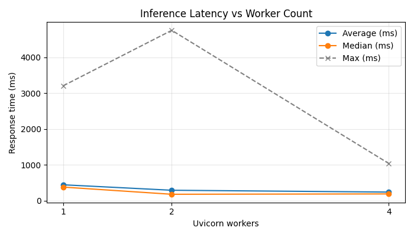
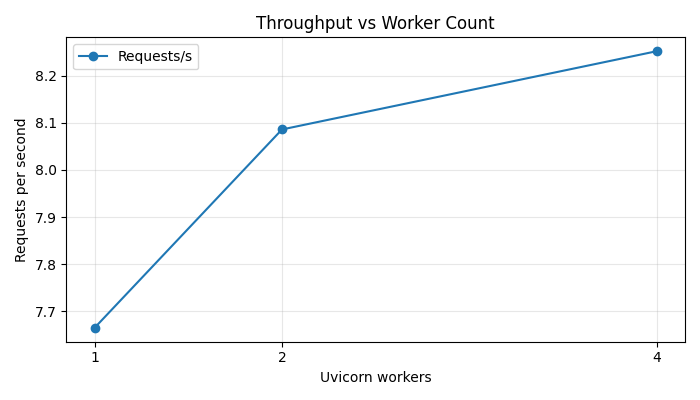

# Locust Scaled Runs Analysis

Summary generated from `locust_results/run_workers_*_stats.csv`.

| workers | requests | failures | median_ms | avg_ms | max_ms | reqs_per_s |
|---:|---:|---:|---:|---:|---:|---:|
| 1 | 446 | 0 | 380.0 | 444.2 | 3204.7 | 7.66 |
| 2 | 472 | 0 | 180.0 | 292.0 | 4750.1 | 8.09 |
| 4 | 476 | 0 | 190.0 | 241.0 | 1037.4 | 8.25 |

**Plots**

**Notes**
- All runs had zero failures. Median and average latencies generally improved as worker count increased in this environment, and throughput increased slightly.